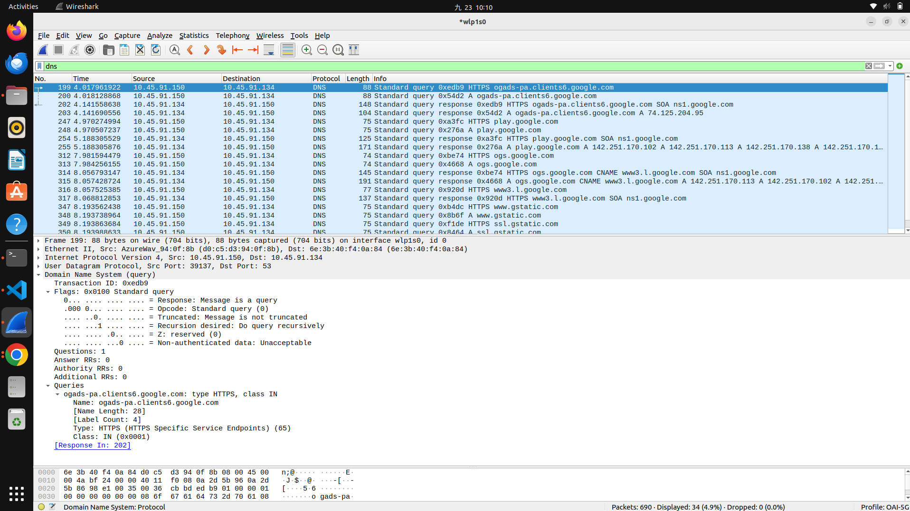
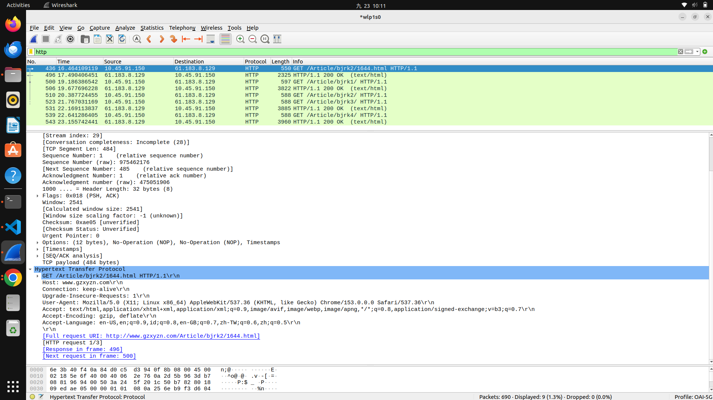
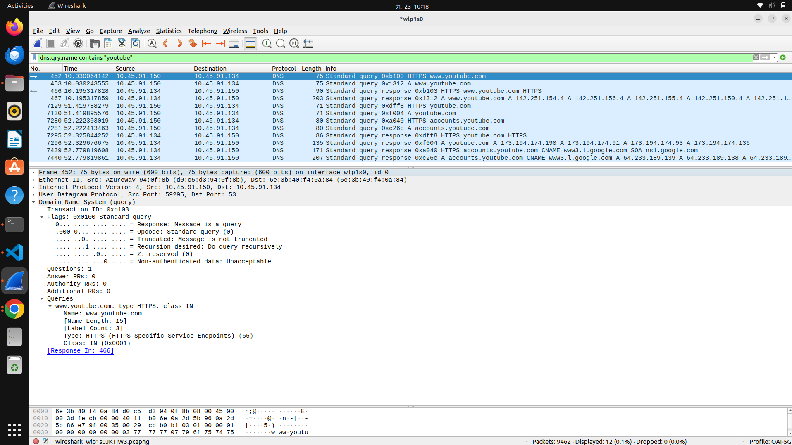
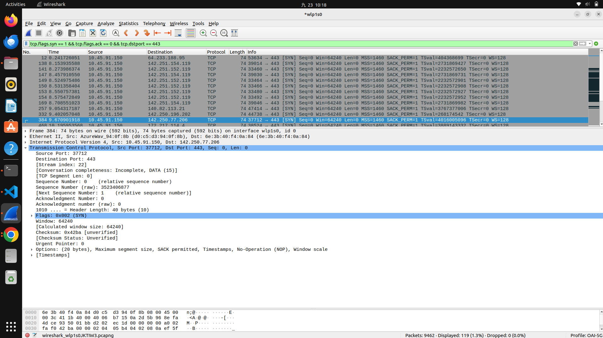
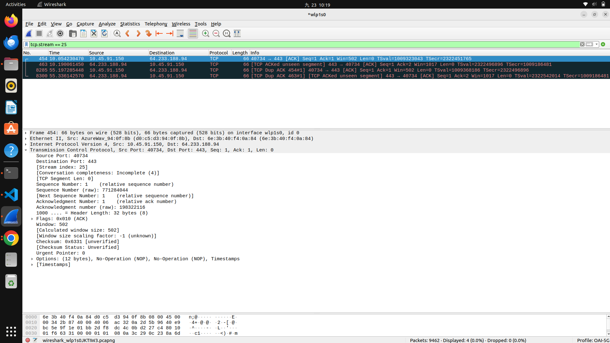

 # Lab 0: Basic Wireshark Operation and Capture

## 1. Wireshark Installation on Ubuntu

```bash
sudo apt update
sudo apt install wireshark -y
sudo chmod +x /usr/bin/dumpcap
wireshark
```

`dumpcap` is Wireshark's packet-capture utility. After installation, open Wireshark and select the active network interface.

## 2. HTTPS Website Capture

Website accessed: `https://www.ntust.edu.tw/home.php`

- Server IP address: `140.118.242.124`
- Server port: `443`
- PC IP address: `10.1.1.13`
- PC source port: `60430`

### TCP Three-Way Handshake

1. **SYN:** The client requests a TCP connection from the server.
2. **SYN-ACK:** The server accepts the request and sends its own synchronization message.
3. **ACK:** The client acknowledges the server. The TCP connection is established.

Evidence:


## 3. DNS Packet Analysis

Display filter:

```wireshark
dns
```

- DNS server IP address: `10.45.91.134`
- DNS server port: `53`
- PC IP address: `10.45.91.150`
- PC source port: `39137`
- Domain queried: `ogads-pa.clients6.google.com`

Protocols from Layer 2 to Layer 5:

- Layer 2: Ethernet II
- Layer 3: IPv4
- Layer 4: UDP
- Layer 5: DNS




## 4. HTTP Page Capture

Page accessed: [http://www.gzxyzn.com/Article/bjrk2/1644.html](http://www.gzxyzn.com/Article/bjrk2/1644.html)

Display filter:

```wireshark
http
```

- Server IP address: `61.183.8.129`
- Server port: `80`
- PC IP address: `10.45.91.150`
- HTTP request method: `GET`
- HTTP request packet: `436`
- HTTP response packet: `496`
- HTTP response status: `200 OK`
- Meaning: The request was successful and the server returned the requested page.




## 5. Capture File

[PCAP file](https://drive.google.com/file/d/1DKfvqWZ1Vw1762YR6uaQpTPFC2o-zGRX/view?usp=sharing)






