# Lab 1 Tasks

## 4. Open and Verify the Capture

### Checkpoint 1: Wireshark Setup — 10 points
Submit:

> The RAN packets appear as `127.0.0.1:9999 → 127.0.0.1:9999`. These are synthetic packets generated by OAI for Wireshark analysis. They are not the actual network addresses of the UE and gNB.

#### A screenshot showing that the OAI-5G profile is selected. — 3 points
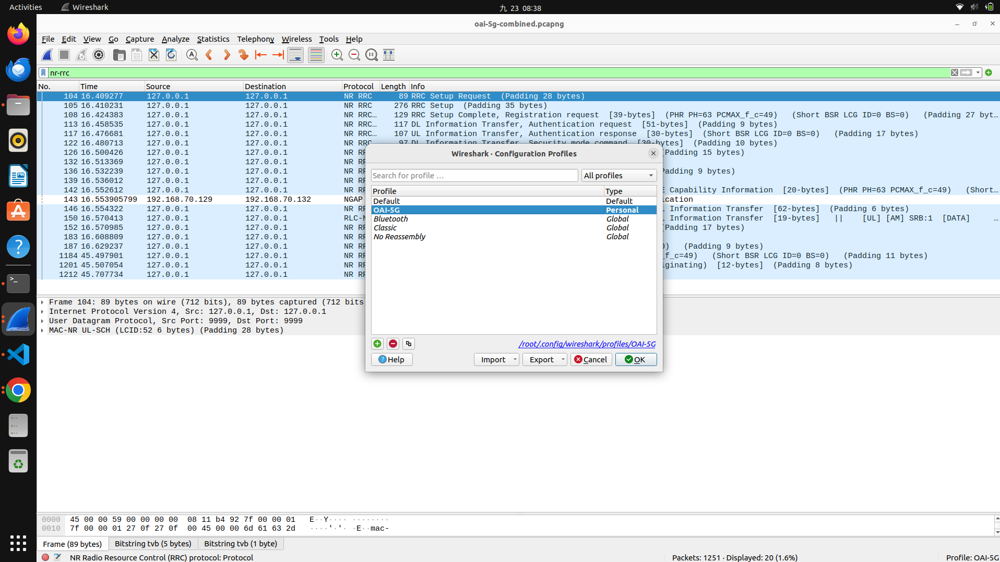

#### A screenshot showing the opened capture. — 2 points
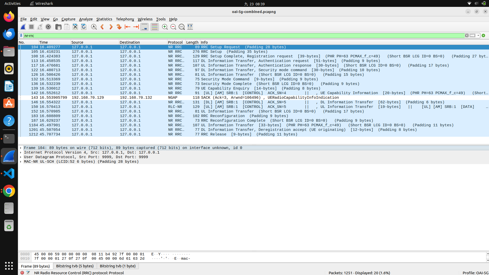


#### A screenshot showing NR RRC packets after applying nr-rrc. — 5 points
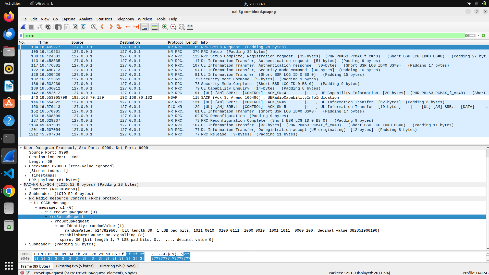

## 5. Identify the basic of 5G SA Architecture

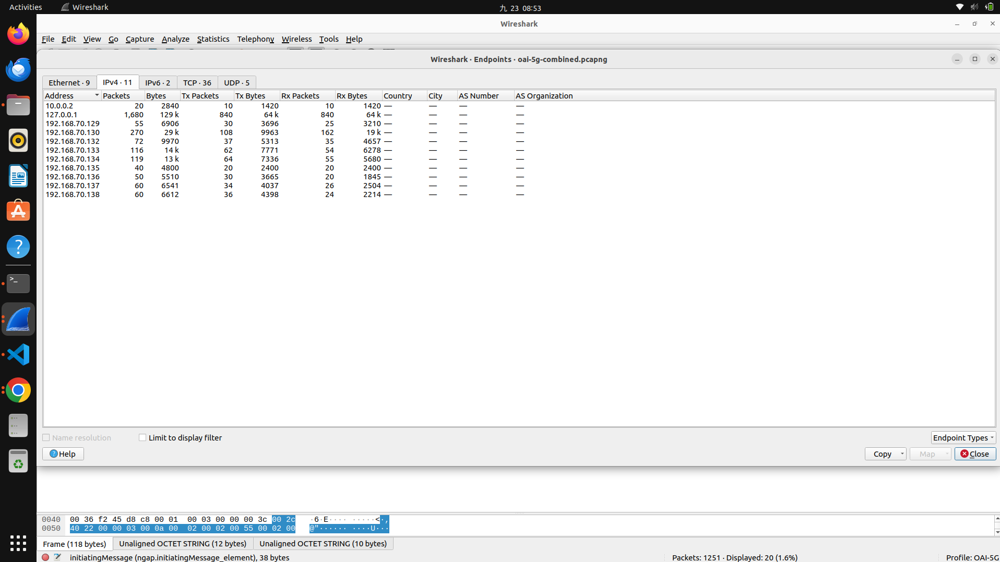

Apply these filters individually:

#### ngap
```wireshark
ngap
```
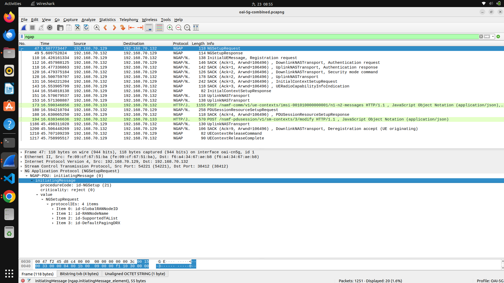

#### gtp
```wireshark
gtp
```
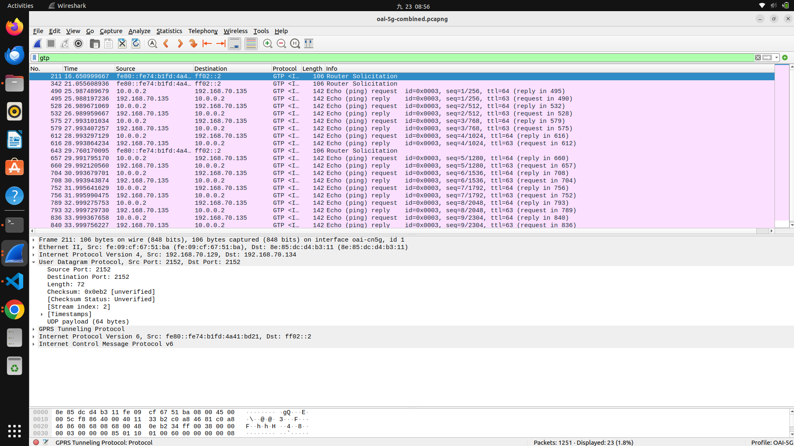

#### icmp
```wireshark
icmp
```
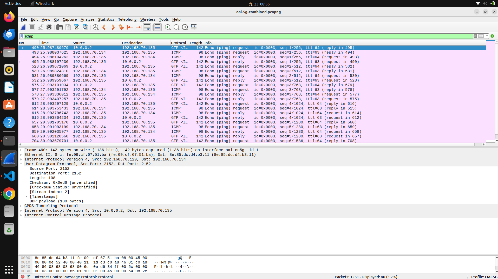

#### Complete the table:

| Component | IP address | Evidence from the capture |
|---|---|---|
| UE PDU address | `10.0.0.2` | Inner IP packet carried in GTP-U; ICMP traffic is shown from `10.0.0.2` to `192.168.70.135`. |
| gNB | `192.168.70.129` | NGAP packets originate from `192.168.70.129`; GTP-U packets also use it as the outer source. |
| AMF | `192.168.70.132` | NGAP packets are exchanged between `192.168.70.129` and `192.168.70.132`. |
| UPF | `192.168.70.134` | GTP-U packet details show outer traffic from `192.168.70.129` to `192.168.70.134`. |
| Data Network | `192.168.70.135` | ICMP packets are exchanged between `10.0.0.2` and `192.168.70.135` inside the GTP-U traffic. |

#### Complete the interface table:

| Interface | Connected components | Main protocol | Purpose |
|---|---|---|---|
| N1 | UE - AMF | NAS | UE registration, authentication, mobility management, and session-management signalling. |
| N2 | gNB - AMF | NGAP | Control-plane signalling between the RAN and the 5G Core. |
| N3 | gNB - UPF | GTP-U | User-plane transport of UE data between the gNB and UPF. |


#### The logical architecture is:

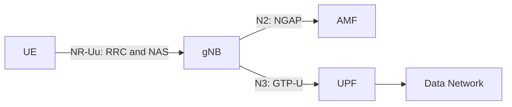

### Checkpoint 2: Basic Architecture 

- [x] Correctly identify the five components and their IP addresses. 
- [x] Correctly explain N1, N2, and N3. 

## Analyzed the RRC Connection Establishment

Find the following messages in order:

1. `RRCSetupRequest`
2. `RRCSetup`
3. `RRCSetupComplete`

### 1. `RRCSetupRequest`
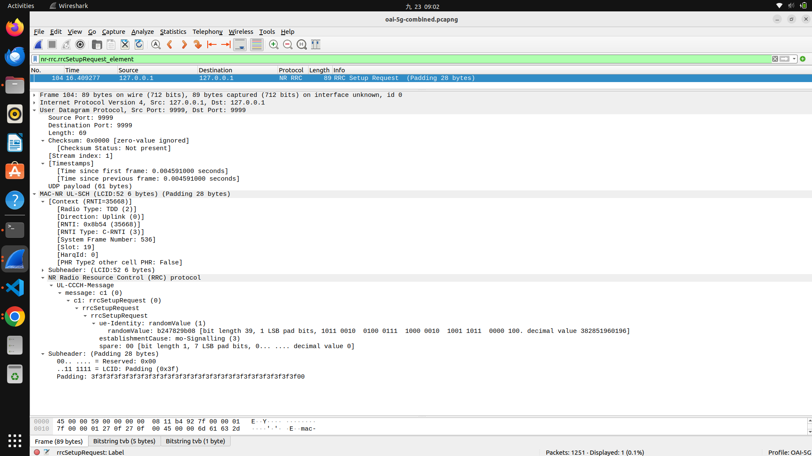

### 2. `RRCSetup`
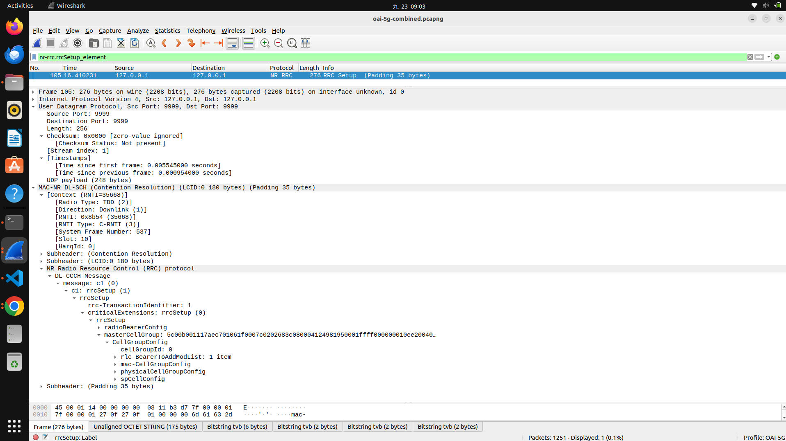

### 3. `RRCSetupComplete`
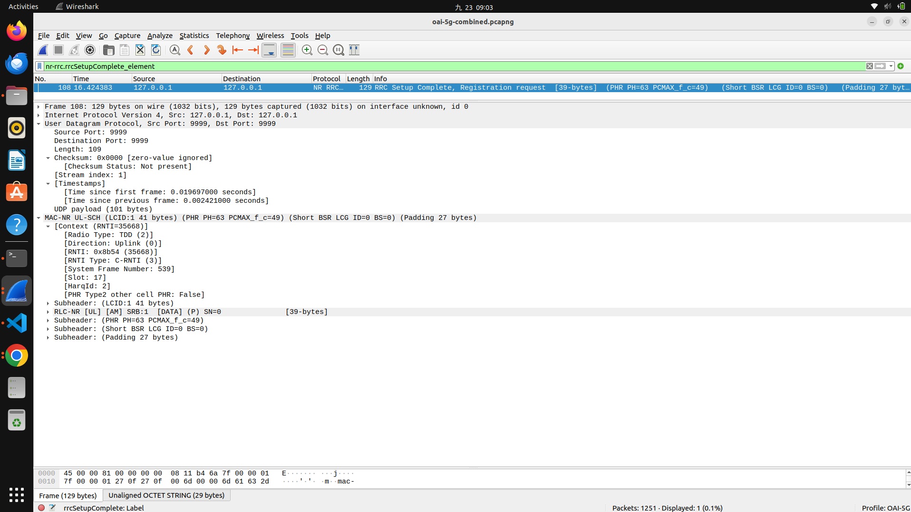

Complete the table:

| Message | Direction | Logical channel / SRB | Main purpose | Packet number |
|---|---|---|---|---:|
| RRCSetupRequest | UE to gNB | UL-CCCH / SRB0 | Requests that the gNB establish an RRC connection. | 104 |
| RRCSetup | gNB to UE | DL-CCCH / SRB0 | Accepts the request and provides the configuration for the RRC connection. | 105 |
| RRCSetupComplete | UE to gNB | UL-DCCH / SRB1 | Confirms that setup is complete and carries the NAS Registration Request toward the 5G Core. | 108 |

Answer the following questions:

> 1.  What is the establishment cause in RRCSetupRequest?
</br>

The establishment cause is `mo-Signalling`, meaning the UE wants to send signalling messages to the network.

> 2. What SRB does RRCSetupRequest use? Why?
</br>

RRCSetupRequest` uses the common control channel, `UL-CCCH`, before a dedicated signaling radio bearer has been set up. It is associated with SRB0.

> 3. Which side sends RRCSetup?
</br>

The gNB sends `RRCSetup` to the UE.

> 4. Which signaling radio bearer is used after the RRC connection is established?
</br>

After the RRC connection is established, signaling uses SRB1 over the dedicated control channel.

> 5. Which NAS message is carried inside RRCSetupComplete?
</br>

`RRCSetupComplete` carries a NAS `Registration Request` message.

> 6. At the end of this procedure, is the UE only connected to the gNB, or is it already registered with the 5G Core? Explain
</br>

At this point, the UE is connected to the gNB and has started registration with the 5G Core. It is not fully registered yet, because the AMF still needs to authenticate the UE and send the registration response, such as `Registration Accept`.

### Checkpoint 3: RRC Connection Establishment 

- [x] Identify all three RRC messages with packet numbers and screenshots. 
- [x] Correctly identify message directions. 
- [x] Correctly identify UL-CCCH, DL-CCCH, SRB0, and SRB1 usage.
- [x] Explain the purpose of each message.
- [x] Explain the difference between RRC connection and 5G Registration. 

## 7. Connect RRC Signaling to NGAP and NAS

The UE exchanges NAS signaling with the AMF through the gNB. On the radio side, the NAS message is carried by RRC. The gNB then forwards it to the AMF through NGAP.

First, 

#### locate `RRCSetupComplete` using:

```wireshark
nr-rrc
```
Expand:

```text
RRCSetupComplete
→ dedicatedNAS-Message
→ Registration Request
```

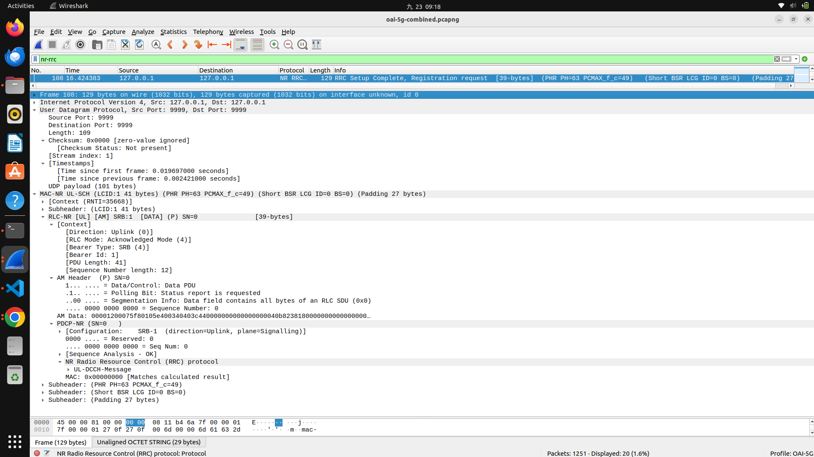

> there are no 
> → dedicatedNAS-Message
> → Registration Request

#### Then apply:

```wireshark
ngap && nas-5gs
```

Locate:

```text
InitialUEMessage
→ NAS-PDU
→ Registration Request
```

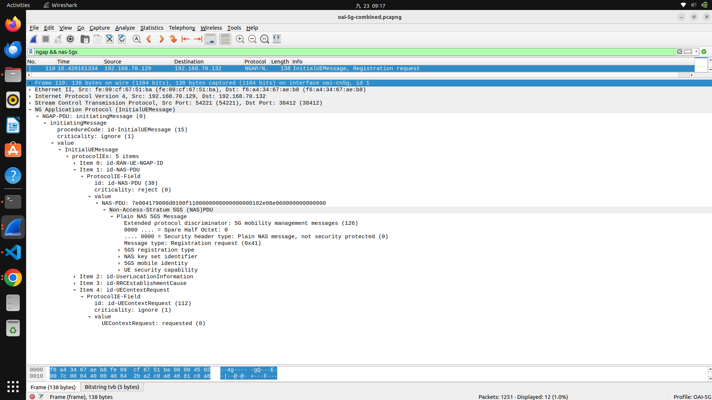

Compare the two packets:

| Stage | Protocol message | Sender → receiver | Encapsulated information |
|---|---|---|---|
| Radio side | RRCSetupComplete | UE → gNB | NAS Registration Request carried inside the RRC message over SRB1 / UL-DCCH. In the synthetic capture, both endpoints appear as `127.0.0.1:9999`. |
| Core side | NGAP InitialUEMessage | gNB → AMF | The same NAS Registration Request carried inside the NGAP NAS-PDU. The capture shows `192.168.70.129` → `192.168.70.132`. |

Finally, locate:

- `Registration Accept`: sent by the AMF to the UE through the gNB. It confirms that the core network has accepted the UE's registration.
- `Registration Complete`: sent by the UE after receiving `Registration Accept`. It confirms that the UE has completed the registration procedure.

Answer:

> 1. What is the role of the gNB when it transports NAS messages?
</br>

The gNB acts as a relay. It carries the UE's NAS message over the radio using RRC, then forwards it to the AMF inside an NGAP message. It transports the message but does not process the NAS registration itself.

> 2. What is the difference between RRC and NAS signaling?
</br>

RRC controls the radio connection between the UE and the gNB, such as setting up SRBs. NAS handles the UE's registration and mobility with the 5G Core and the AMF. In this procedure, NAS is carried inside RRC on the radio side.

> 3. Is the Registration Request delivered directly from the UE to the AMF? Explain the protocol path.
</br>

No. The request follows this path: UE → gNB using RRCSetupComplete, then gNB → AMF using NGAP InitialUEMessage. The gNB forwards the NAS Registration Request to the AMF.

>4. Which message confirms that Registration has completed successfully?
</br>

`Registration Complete`, sent by the UE after it receives `Registration Accept`, confirms that the registration procedure has completed successfully.

### Checkpoint 4: RRC-to-NGAP/NAS Mapping 

- [x] Show the Registration Request inside `RRCSetupComplete`. 
- [x] Show the Registration Request inside NGAP `InitialUEMessage`. 
- [x] Correctly complete the mapping table. 
- [x] Explain the roles of RRC, NGAP, NAS, gNB, and AMF. 
- [x] Identify Registration Accept and Registration Complete. 

## 8. Verify the UE IP Address and User-Plane Traffic

#### Apply:

```wireshark
nas-5gs || ngap
```

Find the PDU Session Establishment Accept and record the UE address:

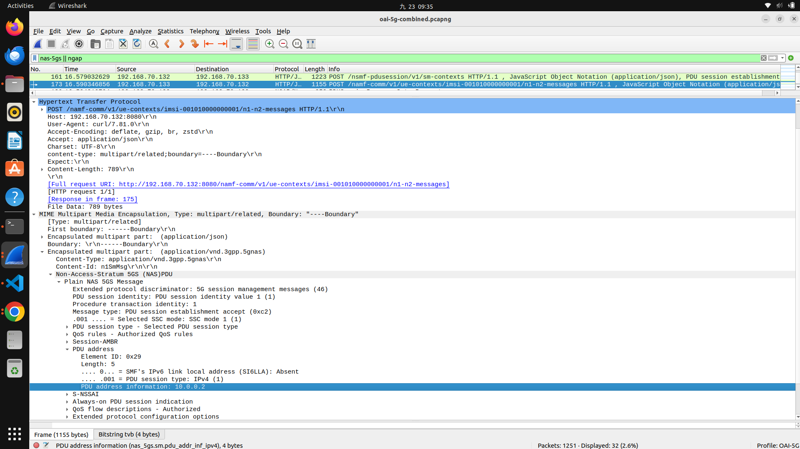

| Field | Observed value |
|---|---|
| UE IPv4 address | 10.0.0.2 |

#### Apply:

```wireshark
gtp || icmp
```

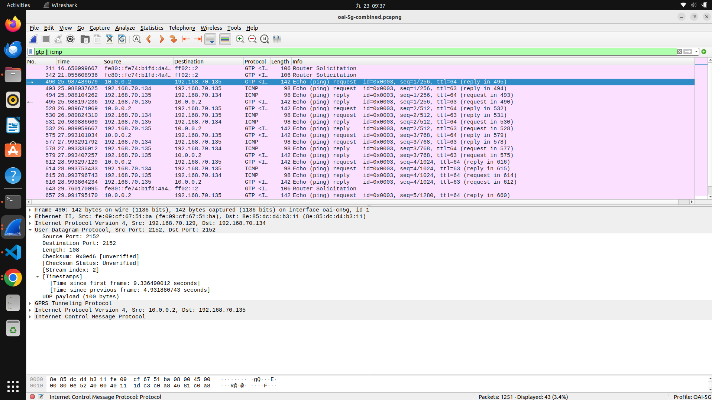

The capture confirms that the UE's IP packet is carried inside GTP-U between the gNB and UPF. For example, packet 490 contains an inner packet from `10.0.0.2` to `192.168.70.135`.

Answer:

> 1. What IPv4 address was assigned to the UE?
</br>

The UE was assigned the IPv4 address `10.0.0.2`.

> 2. How many ICMP Echo Request/Reply pairs are present?
</br>

There are five ICMP Echo Request/Reply pairs, with sequence numbers 1 through 5.

> 3. What does the successful Echo Reply prove about the UE connection?
</br>

The successful Echo Reply proves that the UE has working user-plane connectivity. The packet travels from the UE through the gNB and UPF using GTP-U to the Data Network, and the reply returns successfully to the UE.

### Checkpoint 5: UE IP and User Plane — 15 points

- [x] Identify the UE IPv4 address in the PDU Session Establishment Accept. — 6 points
- [x] Show one ICMP Echo Request and its Echo Reply. — 5 points
- [x] Explain what the successful ping proves. — 4 points

## 9. Final UE Connection Sequence

The following sequence separates the UE and gNB logically, even though the RAN packets in the capture use the synthetic loopback address `127.0.0.1:9999`.

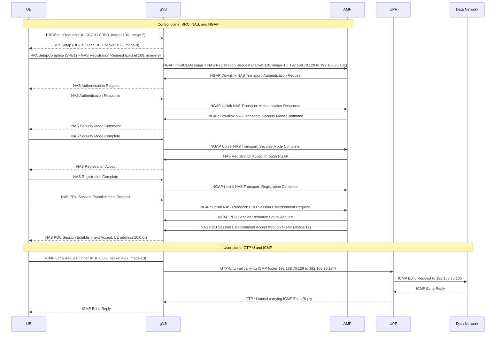

The RRC, NAS, and NGAP messages establish the radio connection, register the UE, and create the PDU session. The later ICMP packets use the user plane: the UE packet is encapsulated in GTP-U between the gNB and UPF before reaching the Data Network.

### Evidence from the capture

| Sequence stage | Evidence |
|---|---|
| RRCSetupRequest | Packet 104, shown in `image-7.png`; UE to gNB over UL-CCCH / SRB0. |
| RRCSetup | Packet 105, shown in `image-8.png`; gNB to UE over DL-CCCH / SRB0. |
| RRCSetupComplete | Packet 108, shown in `image-9.png`; UE to gNB over SRB1. The RAN endpoints appear as `127.0.0.1:9999` because the capture uses synthetic loopback packets. |
| NGAP InitialUEMessage | Packet 110, shown in `image-10.png`; gNB `192.168.70.129` to AMF `192.168.70.132`, carrying the NAS Registration Request. |
| PDU Session Establishment Accept | Shown in `image-12.png`; the UE is assigned `10.0.0.2`. |
| GTP-U and ICMP | Packet 490, shown in `image-13.png`; the inner packet is `10.0.0.2` to `192.168.70.135`, carried over the gNB-UPF tunnel. |

### Checkpoint 6: Final Sequence Diagram — 5 points

- [x] Include the required components and signaling stages. — 3 points
- [x] Clearly distinguish control-plane and user-plane traffic. — 2 points

---

## 10. Submission and Grading

Submit one PDF or Markdown report containing:

- Completed tables
- Answers to all questions
- Packet numbers
- Required screenshots
- Final sequence diagram

Each screenshot must show:

- The display filter
- Packet number
- Info column
- Expanded protocol fields supporting your answer

| Checkpoint | Topic | Points |
|---:|---|---:|
| 1 | Wireshark profile and NR-RRC decoding | 10 |
| 2 | Basic 5G SA architecture | 10 |
| 3 | RRC connection establishment | 35 |
| 4 | RRC-to-NGAP/NAS mapping | 25 |
| 5 | UE IP and GTP-U user plane | 15 |
| 6 | Final sequence diagram | 5 |
|  | **Total** | **100** |
